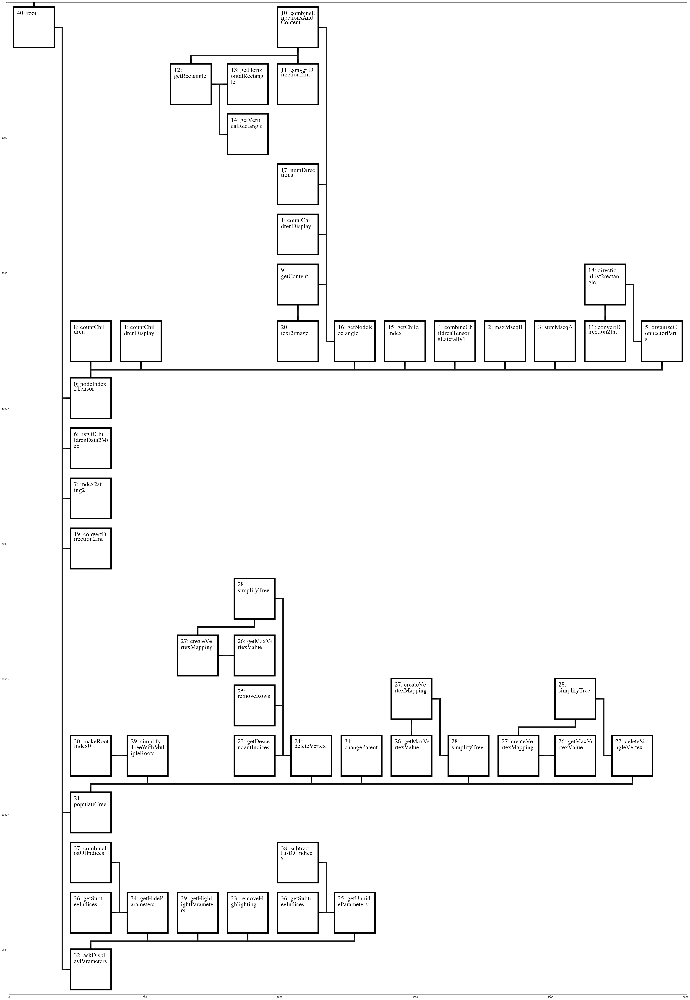
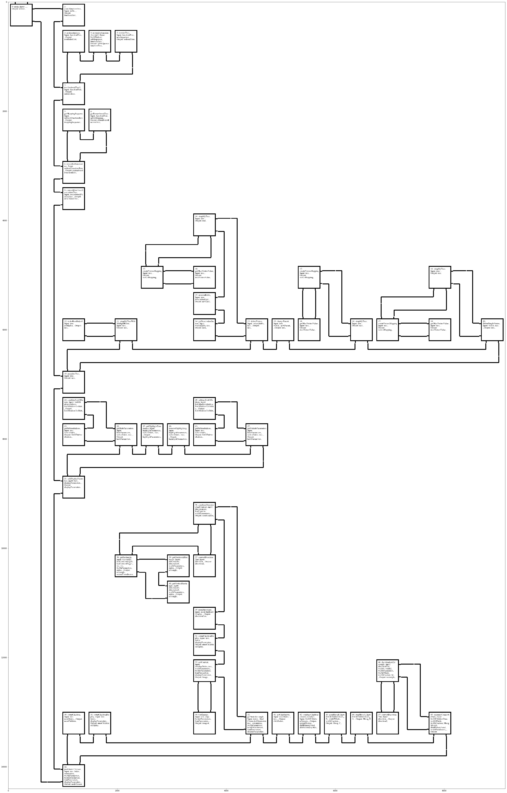

## Welcome to Mark Rosenberg's page.

The following images and gifs show python output on a variety of topics related to complex numbers.

The early work has to do with visualizing complex functions. The initial motivation was for number theory proofs. Then, if everything is proved, what follows? Choice and action. Given the rules (state transition dynamics), what is the optimal policy (function that outputs action given state). Treating quantities as continuous rather than discrete leads to intractable integrals, but with a discrete finite number of bits, there are only so many policies.

The displays are intended to be panels on a personal dashboard, integrated with a calendar and other features, so that individuals can have a visual display on their local devices to interact with their beliefs, goals, schedule, and more. The software in turn may shape one's thinking as an external location for cognitive computations. If individuals can become more efficient in evaluating and updating their beliefs, then increased sustainability should follow. The design of these tools down to the order they were built and even the order of adding lines of code is generally done in a way so that changes to a flowing system are not abrupt, and so that users are empowered to improve sustainably.

### Complex Numbers

Visualizing complex functions is a step towards solving intractable integrals, whose analytic solutions can be used for optimization. 

The first one relates to polynomials. The polynomial's degree is the number of Riemann sheets in the domain and the number of non-trivial coefficients. The image represent the coefficients and zeros of the polynomials. By considering the coefficients in the same space as the roots, the coefficients are centroids of n-simplices in a hypercube topology defined by the roots. When the roots are clustered together, the coefficients have an angular component shown on the x-axis close to multiples of the root angles.

  

This animation relates to continuous Taylor approximations of the exponential function 

  

This image shows the behavior of the zeros of a sum of exponentials. 

  

Bandwidths of visible light and hearing range octaves:

  

Code that visualizes itself.

  

Flow denoting arguments/parameters.

  

A weekly calendar:

  

Animations resembling orbitals.

  

  

  

## Current Projects:

-Created a script that takes a directory path with images and .ics calendar events, and displays them for a specified time interval, placing the photos and events (including recurring) at the timestamp for the corresponding duration. The display is a space-filling curve, which represents moments that are close in time as close in space, so that ends of adjacent weeks or months are not disjoint. Also, the area of the displayed event is directly proportional to the duration.

  

  

Task Completion Performance Tracking. Green is good, red is not yet good.

  

Beginning of display for visualizing state transitions and possible actions.

  

24 hours in a day

  

7 days in a week

  

12 months in a year. Color denoting seasons.

  

Video processing to visualize causal flow.

  

